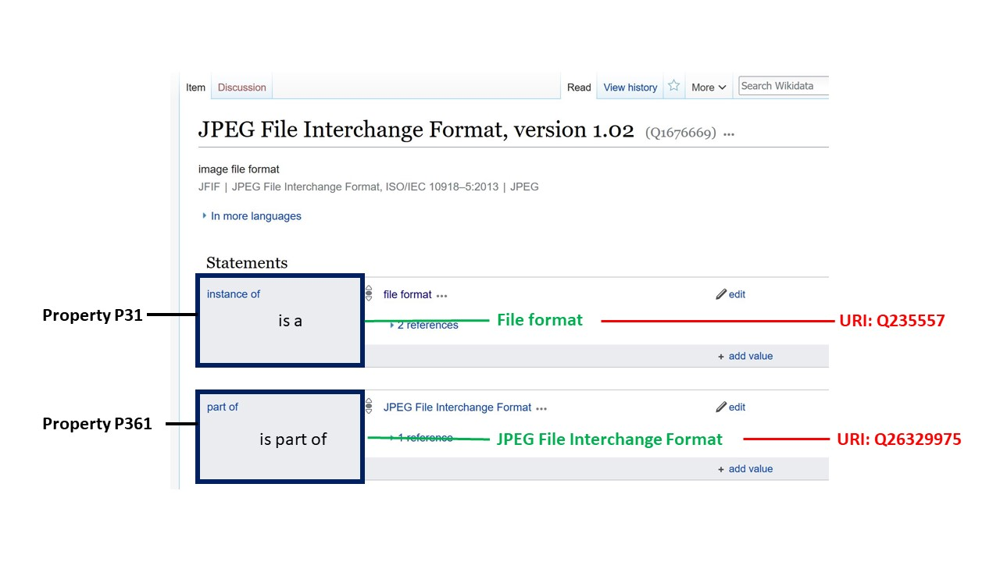

# Wikidata for Digital Preservationists

 

## Introduction

Communities all around the world celebrated the twentieth anniversary of Wikipedia in January 2021. A sister project to Wikipedia, Wikidata is a centralized repository for machine-readable, structured data about cross-domain topics. While Wikipedia provides natural language articles, Wikidata allows us to store structured data and provides a powerful query interface. Wikidata is the first information system with a graphical user interface that supports public read and write access to the semantic web ([_Burgstaller-Muehlbacher_](https://doi.org/10.1093/database/baw015) et al., 2016; [_Good_](https://citeseerx.ist.psu.edu/viewdoc/download?doi=10.1.1.1038.7371\&rep=rep1\&type=pdf) et al., 2016). For digital preservation, this means that anyone with information to contribute about file formats, software, etc. can add it directly to Wikidata. This structured data will then be available as linked open data for others to use, manipulate and combine with other linked data sources as needed.

Digital preservationists require metadata about software, file formats and computing resources for the identification and management of these entities over time. Creating machine-readable metadata about resources in the domain of computing allows digital preservation practitioners to automate programmatic interactions with these entities. For example, EaaSI’s Universal Virtual Interactor reuses data from Wikidata about the file formats that software applications can interact with in order to present the user with an appropriate pre-configured emulated environment. Practitioners working in digital preservation have a shared need for accurate, reusable, technical and descriptive metadata about resources in the domain of computing. Wikidata is a new source for such metadata.

The data about resources in the domain of computing within Wikidata fulfils the functions of a metadata registry (Zeng, 2016). A technical registry in the domain of digital preservation is a data store of descriptions of file formats, software used to create or interact with files, configured environments, operating systems and sustainability factors. The Wikidata community has added structural, descriptive, and technical metadata about these resources to the knowledge base. The combination of these different types of metadata in a single repository enables us to query the data in more flexible ways. The metadata for file formats in Wikidata includes information about who developed the format, how it is related to other formats, and the file format signature. As digital preservation is an international activity, it is especially important that Wikidata is multilingual, and anyone can contribute to the project in their choice of languages.

## Why Wikidata?

The Wikimedia Deutschland chapter of the Wikimedia Foundation launched Wikidata in late 2012 ([Vrandečić](http://dx.doi.org/10.1145/2629489) et al., 2012). The infrastructure of Wikidata is collaboratively built via commons-based peer production ([Müller-Birn](https://doi.org/10.1145/2788993.2789836) et al., 2015). Commons-based peer production is the name given to open collaboration systems where users create content under the agreement that all content will remain in the public domain. This means that all the work produced by the community is free to be reused by others. The peer production aspect refers to how users coordinate work themselves. Wikidata is edited by volunteers from all over the world in more than 350 languages ([Erxleben](https://link.springer.com/content/pdf/10.1007/978-3-319-11964-9\_4.pdf) et al., 2014). For cultural heritage institutions with limited digital preservation budgets, this means that they can now access descriptive and technical metadata for tens of thousands software titles and more than five thousand file formats without having to create, manage, or maintain that data locally.

The fact that Wikidata can be edited by anyone raises concerns about accuracy and trustworthiness of information. The reference model of Wikidata makes it possible to provide a source for each statement contributed. By reviewing the references, we could see if data came from PRONOM, TrID, English Wikipedia, or any other source. For a more extensive discussion of these issues see this blog post ([Thornton and Cochrane](https://openpreservation.org/blogs/wikidata-as-a-digital-preservation-knowledgebase/), 2016).

The Wikidata community maintains a public SPARQL endpoint. SPARQL is a query language for structured data. As of 2018 the endpoint was consistently handling millions of SPARQL queries per day, demonstrating that it is meeting the requirements of active public use ([Malyshev](https://iccl.inf.tu-dresden.de/w/images/5/5a/Malyshev-et-al-Wikidata-SPARQL-ISWC-2018.pdf) et al., 2018). Writing SPARQL queries for the Wikidata endpoint allows users to search for data about resources in a flexible way. SPARQL queries enable us to search for file formats by media type, to search for software titles by their readable file formats, or to search for software titles published within specific periods ([Thornton](https://osf.io/ygx68/download) et al., 2019). We can use SPARQL queries to search for software titles by genre, to search for technical specifications that describe a particular file format, or to search for a digitized copy of a user guide for a piece of legacy software. Due to the fact that Wikidata is a cross-domain knowledge base, users are able to query data in combination with many other types of data in Wikidata.

## Data Model

The core of the Wikidata data model ([_MediaWiki_](https://www.mediawiki.org/wiki/Wikibase/DataModel), 2021) consists of items and properties. Properties are used to express statements about items. In Figure 1, we see a screenshot of the Wikidata page for item: “JPEG File Interchange Format, version 1.02”. Each item is allotted a page in Wikidata and has a unique identifier, with prefix “Q” plus a string of numbers which is assigned to this item. The two properties “instance of” and “part of” are used to assert statements about the item. A claim and its references are a “statement”. Sets of properties are not pre-defined for classes in Wikidata. Editors may freely select properties to express statements on Wikidata items.

> Figure 1: Example of Wikidata properties

An option for editing in accordance with the data model is to use the Wikidata for Digital Preservation portal ([_Wikidata_](https://wikidp.org/), n.d.). The Wikidata for Digital Preservation Portal facilitates search across the current content in Wikidata ([_Thornton_](http://doi.org/10.5281/zenodo.1214319) et al., 2018). Kenneth Seals-Nutt is the software engineer who built the portal. Carl Wilson of the Open Preservation Foundation generously provides the hosting for this portal and has consulted on portions of the portal architecture. Data models in Wikidata are created and extended by editors of the project ([Thornton](http://www-archive.cseas.kyoto-u.ac.jp/ipres2017.jp/wp-content/uploads/7.pdf) et al., 2017). The Wikidata for Digital Preservation portal mirrors these data models. For a more detailed description of portal functionality please see ([_Thornton_](http://doi.org/10.5281/zenodo.1214319) et al., 2018).

Connecting Wikidata items to resources in external databases or systems allows for software agents to discover related content automatically. This allows users to benefit from complementary work and provides infrastructure for connecting information that was previously fragmented across multiple systems. These connections are made using properties that link to external resources. For example, in the domain of software preservation, connecting the work of the Internet Archive to Wikidata helps more people discover information about legacy software. The Old School Emulation Center ([_TOSEC_](https://www.tosecdev.org/), n.d.) has created detailed descriptions of many legacy computing platforms and provides disk images for a wide variety of software titles. TOSEC also provides in-browser emulation of many software titles. Using property P724 “Internet Archive ID'' the pages dedicated to these resources can be connected to their corresponding items in Wikidata.

Items in Wikidata are connected to external databases such as TOSEC using properties that have the data type “external id''. More than half of all properties in Wikidata are external id properties. Connecting Wikidata items to other resources in this way is a powerful feature allowing us to fulfill the promise of linked open data ([Hyvönen](https://doi.org/10.2200/S00452ED1V01Y201210WBE003), 2012). By following external id links, users can discover more information about the item of interest. As more external identifiers are published to the Wikidata knowledge base it grows in prominence as a cross-switch for identifiers and vocabularies (Zeng, 2016). Wikidata is becoming a hub of persistent identifiers ([_Neubert_](http://ceur-ws.org/Vol-1937/paper2.pdf), 2017). As users contribute additional data to Wikidata it will become even more valuable.

## Ideas for How to Contribute

Wikidata has a vibrant community of editors ([Sarasua](https://eprints.whiterose.ac.uk/140352/1/evolution-wikidata-editors.pdf) et al., 2019). Seeing how others have described software and file formats can be a useful way to become familiar with the system. WikiProject Informatics ([_WikiProject Informatics_](https://www.wikidata.org/wiki/Wikidata:WikiProject\_Informatics)\* \*2021a) is a great place to learn about how data is structured in the domain of computing. This WikiProject is a set of pages that the community uses to organize work and communicate with one another. The rest of this chapter provides some ideas on contributing useful digital preservation information to Wikidata.

### Labels and Descriptions in your language

Wikidata supports hundreds of human languages. Each item has space for a label and description in each of the languages supported. Currently there is an English-language bias in Wikidata ([_Kaffee_](https://doi.org/10.1145/3306446.3340826) et al., 2019). Properties also have labels and descriptions in each of the languages supported by Wikidata ([_Samuel_](https://link.springer.com/chapter/10.1007/978-3-319-98932-7\_12), 2018). Adding labels and descriptions in languages you know for properties is an excellent way to contribute to Wikidata.

There are hundreds of properties related to computing used in Wikidata. Using the WDProp tool it is possible to see an overview of properties by domain. For example, see the WDProp [list](https://wdprop.toolforge.org/search.html?search=software\&language=en) of properties related to software ([_WDProp_](https://wdprop.toolforge.org/search.html?search=software\&language=en), n.d.). This tool also offers a compare function that allows you to explore which properties are missing labels and descriptions in any of the supported languages ([_Samuel_](https://wikiworkshop.org/2018/papers/wikiworkshop2018\_paper\_12.pdf), 2018).

### Curating Software Items

Connecting software items to relevant file format items allows us to gain a greater understanding of these two types of resources. An important pair of properties for connecting software items and file formats are “readable file format” P1072 ([_Wikidata_](https://www.wikidata.org/wiki/Property:P1072), 2021b) and “writable file format” P1073 ([_Wikidata_](https://www.wikidata.org/wiki/Property:P1073), 2021c). These properties can be used if you know what file formats can be opened by or created by a particular software title.

If you have knowledge of software titles that do not yet have a Wikidata item, you are most welcome to add them to Wikidata. Once you have created the new item, you can choose from relevant properties to create statements based on the source material you are consulting. Adding references to the source material for each statement is a best practice ([_Wikidata_](https://www.wikidata.org/wiki/Help:Sources), 2021d).

If you have information about when software titles were published, you may want to consider adding “publication date” P577 to the items for various software titles. This type of information may be available from sites such as oldversion.com ([_oldversion.com_](http://www.oldversion.com/)\*, \*n.d.). Another way to find this information is consulting old issues of computing magazines made available by the Internet Archive and add interesting information you discover to Wikidata ([_marinalewis_](https://blog.archive.org/2020/12/30/computerworld-archives-back-from-vintage-microfilm/), 2020).

There are thousands of items for software companies in Wikidata. Some of them are already connected to the software titles they have created; some are not yet linked using property P173 “developer”. If you'd like to work on adding statements to the items for the companies themselves, you can get an idea of some properties to consider by looking at the schema ([_Wikidata_](https://www.wikidata.org/wiki/EntitySchema:E73), 2021e) for software companies.

### Exploring Wikidata Tools

Contributors to Wikidata community have developed a diverse set of tools that can be used to accomplish specific types of work in the Wikidata ecosystem. A helpful overview, with descriptions of each tool, is available on Wikidata ([_Wikidata_](https://www.wikidata.org/wiki/Wikidata:Tools), 2021f). A tool called _Mix'n'Match_ holds catalogs of items to be reviewed ([_Mix'n'Match_](https://mix-n-match.toolforge.org/#/) n.d.). Working in Mix'n'Match allows you to match names to existing Wikidata entries. Once a match is made, some appropriate statements are created for the match. Mix'n'Match contains a category for computing ([_Wikimedia_](https://meta.wikimedia.org/wiki/Mix'n'match/Catalogues#Computing,\_information\_technology), 2021). There are also multiple categories for video game catalogs.

Wikidata contains items for millions of scientific articles. This includes computing literature. Some of these articles describe software titles, file formats or other types of computing resources. If you are interested in this area, you may want to connect scientific articles to the items they describe using property P921 “main subject”. An example of such connections can be seen in a query for scientific articles that have a software item listed as a main subject ([_Wikidata Query Service_](https://w.wiki/$Q2), n.d.a).

Fans and supporters of the Software Heritage project may be interested in property P6138 “Software Heritage identifier (SWHID)". This property can be used to connect a software item to a corresponding resource in the Software Heritage Archive. Software Heritage identifiers are useful for identifying source code ([Di Cosmo](https://hal.archives-ouvertes.fr/hal-01865790/document) et al., 2018 and [Di Cosmo](https://arxiv.org/pdf/2001.08647) et al., 2019).

### Curating Hardware Items

The website Old-Computers.com ([_Old-Computers.com_](https://www.old-computers.com/)\*, \*n.d.) has a lot of information that is not yet available in Wikidata. This could be a source of information if you're interested in hardware or legacy computer models. There is already a property for the site available in Wikidata and there is a query for items with an Old-Computers identifier ([_Wikidata Query Service_](https://w.wiki/w9G), n.d.b). It would be possible to work from this list to add additional statements to any of these items from the site.

### Searching for Source Material

Wikipedia articles link to Wikidata items and they often contain plenty of information that has not yet been added to Wikidata. Most articles in the various language versions of Wikipedia contain a link to a corresponding Wikidata item. If you find an article in Wikipedia full of great information, this could be a starting place for ideas of what additional statements you could add to Wikidata. You may even be able to find sources for the statements you create in Wikidata from the references section of the Wikipedia article.

Many computer history museums around the world contain archival holdings related to the history of computing. These materials are a useful place to consult for reference material. While many archival collections have not been digitized or made available on the web, there are often parts of their collections that can be viewed online. For example, the Computer History Museum in the United States has a detailed history ([_CHM_](https://computerhistory.org/stories/spinoff-fairchild/), 2021) of companies that trace their origins to people affiliated with Fairchild Semiconductor. Many of the relationships described in this article are not yet represented in Wikidata. As of January 2021, only two founders are listed on the Fairchild Semiconductor item in Wikidata ([_Wikidata_](https://www.wikidata.org/wiki/Q1096013), 2021g).

## Conclusion

We have many options regarding participation in the Wikidata community. Some people may want to actively contribute data and see the result of their work in the system itself. Others may want to participate in discussions with Wikidatans to help create models that work for real-life workflows related to digital preservation. Others may want to identify gaps in the data or areas in need of improvement. Others may want to reuse data.

Centralizing the metadata for the domain of computing, whether technical metadata or descriptive metadata, eliminates redundant labour of individual institutions creating structured data within their local systems. When we collaboratively create metadata and publish it in Wikidata, anyone can reuse it. This allows metadata professionals to focus on the administrative, preservation, and use metadata pertinent to their local settings.

Infrastructure supported by the Wikimedia foundation, built and maintained by an active community of tens of thousands of contributors is a new option for cultural heritage institutions. The fact that this infrastructure is built in conformance to open standards, and is comprised of free software which we can inspect, means that we can audit this system and ensure that we can continue to trust it to store and access our data.

## References

Burgstaller-Muehlbacher, S., Waagmeester, A., Mitraka, E., Turner, J., Putman, T., Leong, J., Naik, C., Pavlidis, P., Schriml, L., Good, B.M. and Su, A.I., 2016. Wikidata as a semantic framework for the Gene Wiki initiative. _Database_, _2016_. Available at: [https://doi.org/10.1093/database/baw015](https://doi.org/10.1093/database/baw015)

CHM, 2021. Spinoff: Fairchild and the family tree of Silicon Valley. Available at: [http://web.archive.org/web/20211006175730/https://computerhistory.org/stories/spinoff-fairchild/](http://web.archive.org/web/20211006175730/https:/computerhistory.org/stories/spinoff-fairchild/)

Di Cosmo, R., Gruenpeter, M. and Zacchiroli, S., 2018. Identifiers for digital objects: the case of software source code preservation. In iPRES 2018-15th International Conference on Digital Preservation (pp. 1-9). Available at: [https://web.archive.org/web/20200619121656/https://hal.archives-ouvertes.fr/hal-01865790/document](https://web.archive.org/web/20200619121656/https:/hal.archives-ouvertes.fr/hal-01865790/document)

Di Cosmo, R., Gruenpeter, M. and Zacchiroli, S., 2019. Referencing source code artifacts: a separate concern in software citation. Computing in Science & Engineering, 22(2), pp.33-43. Available at: [https://web.archive.org/web/20211013083450/https://arxiv.org/pdf/2001.08647.pdf](https://web.archive.org/web/20211013083450/https:/arxiv.org/pdf/2001.08647.pdf)

Erxleben, F., Günther, M., Krötzsch, M., Mendez, J. and Vrandečić, D., 2014. Introducing Wikidata to the linked data web. In International semantic web conference (pp. 50-65). Springer, Cham. Available at: [https://web.archive.org/web/20170916025051/https://link.springer.com/chapter/10.1007/978-3-319-11964-9\_4?no-access=true](https://web.archive.org/web/20170916025051/https:/link.springer.com/chapter/10.1007/978-3-319-11964-9\_4?no-access=true)

Good, B.M., Burgstaller-Muehlbacher, S., Mitraka, E., Putman, T., Su, A.I. and Waagmeester, A., 2016. Opportunities and Challenges Presented by Wikidata in the Context of Biocuration. In ICBO/BioCreative. Available at: [https://web.archive.org/web/20211014121624/https://citeseerx.ist.psu.edu/viewdoc/download?doi=10.1.1.1038.7371\&rep=rep1\&type=pdf](https://web.archive.org/web/20211014121624/https:/citeseerx.ist.psu.edu/viewdoc/download?doi=10.1.1.1038.7371\&rep=rep1\&type=pdf)

Hyvönen, E., 2012. Publishing and using cultural heritage linked data on the semantic web. Synthesis Lectures on the Semantic Web: Theory and Technology, 2(1), pp.1-159. Available at: [https://doi.org/10.2200/S00452ED1V01Y201210WBE003](https://doi.org/10.2200/S00452ED1V01Y201210WBE003)

Kaffee, L.A., Endris, K.M. and Simperl, E., 2019. When humans and machines collaborate: cross-lingual label editing in Wikidata. In Proceedings of the 15th International Symposium on Open Collaboration (pp. 1-9). Available at: [https://doi.org/10.1145/3306446.3340826](https://doi.org/10.1145/3306446.3340826)

Malyshev, S., Krötzsch, M., González, L., Gonsior, J. and Bielefeldt, A., 2018. Getting the most out of wikidata: Semantic technology usage in Wikipedia's knowledge graph. In International Semantic Web Conference (pp. 376-394). Springer, Cham. Available at: [_https://web.archive.org/web/20210323200527/https://iccl.inf.tu-dresden.de/w/images/5/5a/Malyshev-et-al-Wikidata-SPARQL-ISWC-2018.pdf_](https://web.archive.org/web/20210323200527/https:/iccl.inf.tu-dresden.de/w/images/5/5a/Malyshev-et-al-Wikidata-SPARQL-ISWC-2018.pdf)

Marinalewis, 2020. Computerworld Archives Back From Vintage Microfilm. Internet Archive Blogs. Available at: [http://web.archive.org/web/20211122084835/https://blog.archive.org/2020/12/30/computerworld-archives-back-from-vintage-microfilm/](http://web.archive.org/web/20211122084835/https:/blog.archive.org/2020/12/30/computerworld-archives-back-from-vintage-microfilm/)

MediaWiki, 2021. Wikibase/DataModel. Available at: [http://web.archive.org/web/20210713023100/https://www.mediawiki.org/wiki/Wikibase/DataModel](http://web.archive.org/web/20210713023100/https:/www.mediawiki.org/wiki/Wikibase/DataModel)

Mix’n’Match, n.d. Available at: [http://web.archive.org/web/20211011132548/https://mix-n-match.toolforge.org/](http://web.archive.org/web/20211011132548/https:/mix-n-match.toolforge.org/)

Müller-Birn, C., Karran, B., Lehmann, J. and Luczak-Rösch, M., 2015. Peer-production system or collaborative ontology engineering effort: What is Wikidata?. In Proceedings of the 11th International Symposium on Open Collaboration (pp. 1-10). Available at: [https://doi.org/10.1145/2788993.2789836](https://doi.org/10.1145/2788993.2789836).

Neubert, J., 2017. Wikidata as a linking hub for knowledge organization systems? Integrating an authority mapping into Wikidata and learning lessons for KOS mappings. In Proceedings of the 17th European Networked Knowledge Organization Systems Workshop co-located with the 21st International Conference on Theory and Practice of Digital Libraries (pp.14-25). Available at: [_https://web.archive.org/web/20210828050823/http://ceur-ws.org/Vol-1937/paper2.pdf_](https://web.archive.org/web/20210828050823/http:/ceur-ws.org/Vol-1937/paper2.pdf)

Old-Computers.com, n.d. Available at: [_http://web.archive.org/web/20210727070043/https://www.old-computers.com/_](http://web.archive.org/web/20210727070043/https:/www.old-computers.com/)

Oldversions.com, n.d. Available at: [_http://web.archive.org/web/20211120142324/http://www.oldversion.com/_](http://web.archive.org/web/20211120142324/http:/www.oldversion.com/)

Samuel, J., 2018. Analyzing and visualizing translation patterns of Wikidata properties. In International Conference of the Cross-Language Evaluation Forum for European Languages (pp. 128-134). Springer, Cham. Available at: [_https://web.archive.org/web/20211006202031/https://link.springer.com/chapter/10.1007/978-3-319-98932-7\_12_](https://web.archive.org/web/20211006202031/https:/link.springer.com/chapter/10.1007/978-3-319-98932-7\_12)

Samuel, J., 2018. Towards understanding and improving multilingual collaborative ontology development in Wikidata. In Companion of the The Web Conference 2018 on The Web Conference (pp. 23-27). Available at: [_https://web.archive.org/web/20211006130416/https://wikiworkshop.org/2018/papers/wikiworkshop2018\_paper\_12.pdf_](https://web.archive.org/web/20211006130416/https:/wikiworkshop.org/2018/papers/wikiworkshop2018\_paper\_12.pdf)

Sarasua, C., Checco, A., Demartini, G., Difallah, D., Feldman, M. and Pintscher, L., 2019. The evolution of power and standard Wikidata editors: comparing editing behavior over time to predict lifespan and volume of edits. Computer Supported Cooperative Work (CSCW), 28(5), pp.843-882. Available at: [https://web.archive.org/web/20200803185205/https://eprints.whiterose.ac.uk/140352/1/evolution-wikidata-editors.pdf](https://web.archive.org/web/20200803185205/https:/eprints.whiterose.ac.uk/140352/1/evolution-wikidata-editors.pdf)

Thornton, K and Cochrane, E. Wikidata as a digital preservation knowledgebase, 2016. Open Preservation Foundation Blog. Available at: [https://web.archive.org/web/20210707132113/https://openpreservation.org/blogs/wikidata-as-a-digital-preservation-knowledgebase/](https://web.archive.org/web/20210707132113/https:/openpreservation.org/blogs/wikidata-as-a-digital-preservation-knowledgebase/)

Thornton, K., Cochrane, E., Ledoux, T., Caron, B. and Wilson, C., 2017. Modeling the Domain of Digital Preservation in Wikidata. In Proceedings of iPRES Conference, Kyoto, Japan, September 2017 (iPRES 2017). Available at: [https://web.archive.org/web/20210707132113/https://openpreservation.org/blogs/wikidata-as-a-digital-preservation-knowledgebase/](https://web.archive.org/web/20210707132113/https:/openpreservation.org/blogs/wikidata-as-a-digital-preservation-knowledgebase/)

Thornton, K., Seals-Nutt, K., Cochrane, E., and Wilson, C., 2018. Wikidata for Digital Preservation. Available at: [http://doi.org/10.5281/zenodo.1214319](http://doi.org/10.5281/zenodo.1214319)

Thornton, K., and Seals-Nutt, K., 2019. Getting Digital Preservation Data out of Wikidata. In Proceedings of the 16th International Conference on Digital Preservation. Available at: [_https://web.archive.org/web/20211013090827/https://files.de-1.osf.io/v1/resources/guj3p/providers/osfstorage/5dd7f5906fc7690009d4dc64?action=download\&direct\&version=1_](https://web.archive.org/web/20211013090827/https:/files.de-1.osf.io/v1/resources/guj3p/providers/osfstorage/5dd7f5906fc7690009d4dc64?action=download\&direct\&version=1)

TOSEC, n.d. Available at: [_https://web.archive.org/web/20211029162615/https://www.tosecdev.org/_](https://web.archive.org/web/20211029162615/https:/www.tosecdev.org/)

Vrandečić, D. and Krötzsch, M., 2014. Wikidata: a free collaborative knowledgebase. Communications of the ACM, 57(10), pp.78-85. Available at: [http://dx.doi.org/10.1145/2629489](http://dx.doi.org/10.1145/2629489).

WDProp, n.d. Available at: [http://web.archive.org/web/20200808030002/https://wdprop.toolforge.org/search.html?search=software\&language=en](http://web.archive.org/web/20200808030002/https:/wdprop.toolforge.org/search.html?search=software\&language=en)

Wikidata, Wikidata for Digital Preservation, n.d. Available at: [http://web.archive.org/web/20210305130407/https://wikidp.org/about](http://web.archive.org/web/20210305130407/https:/wikidp.org/about)

Wikidata, 2021a. Wikidata:WikiProjects Informatics. Available at: [http://web.archive.org/web/20211122083819/https://www.wikidata.org/wiki/Wikidata:WikiProject\_Informatics](http://web.archive.org/web/20211122083819/https:/www.wikidata.org/wiki/Wikidata:WikiProject\_Informatics)

Wikidata, 2021b. Readable file format P1072. Available at: [https://web.archive.org/web/20211102125849/https://www.wikidata.org/wiki/Property:P1072](https://web.archive.org/web/20211102125849/https:/www.wikidata.org/wiki/Property:P1072)

Wikidata, 2021c. Writeable file format P1073. Available at: [https://web.archive.org/web/20211121110340/https://www.wikidata.org/wiki/Property:P1073](https://web.archive.org/web/20211121110340/https:/www.wikidata.org/wiki/Property:P1073)

Wikidata, 2021d. Help:Sources. Available at: [http://web.archive.org/web/20210818224235/https://www.wikidata.org/wiki/Help:Sources](http://web.archive.org/web/20210818224235/https:/www.wikidata.org/wiki/Help:Sources)

Wikidata, 2021e. Software Companies. Available at: [https://web.archive.org/web/20211013094751/https://www.wikidata.org/wiki/EntitySchema:E73](https://web.archive.org/web/20211013094751/https:/www.wikidata.org/wiki/EntitySchema:E73)

Wikidata, 2021f. Wikidata:Tools. Available at: [http://web.archive.org/web/20211007023002/https://www.wikidata.org/wiki/Wikidata:Tools](http://web.archive.org/web/20211007023002/https:/www.wikidata.org/wiki/Wikidata:Tools)

Wikidata, 2021g. Fairchild Semiconductor. Available at: [http://web.archive.org/web/20201124133356/https://www.wikidata.org/wiki/Q1096013](http://web.archive.org/web/20201124133356/https:/www.wikidata.org/wiki/Q1096013)

Wikidata Query Service, n.d.a. Available at: [https://w.wiki/$Q2](https://w.wiki/$Q2)

Wikidata Query Service, n.d.b. Available at: [https://w.wiki/w9G](https://w.wiki/w9G)

Wikimedia, 2021. Mix’n’match/Catalogues. Available at: [http://web.archive.org/web/20210811142043/https://meta.wikimedia.org/wiki/Mix'n'match/Catalogues](http://web.archive.org/web/20210811142043/https:/meta.wikimedia.org/wiki/Mix'n'match/Catalogues)

Zeng, M.L. and Qin, J., 2016. _Metadata_. Facet.
